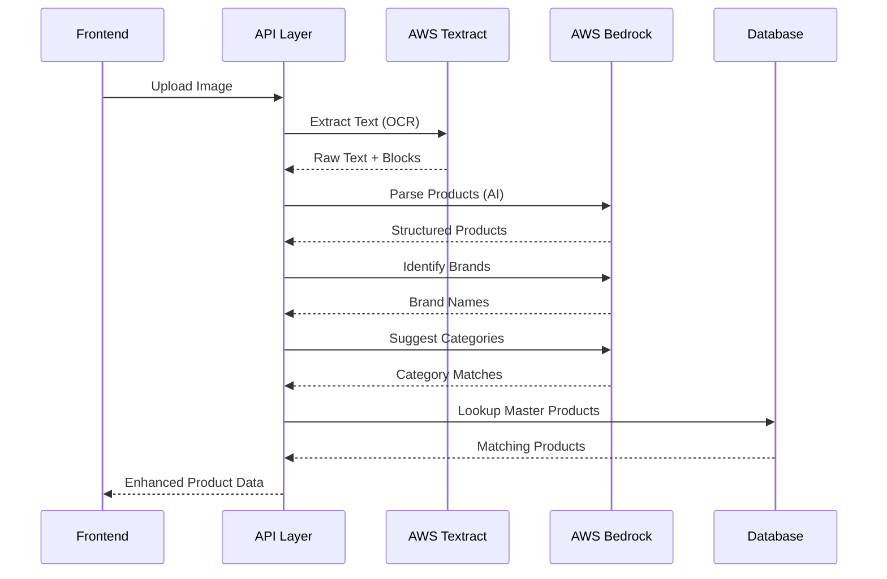

# Design Document

## Overview

This design document outlines the technical implementation for AI-powered product extraction and categorization enhancements. The system integrates AWS Textract for OCR, AWS Bedrock for intelligent AI parsing, and a Python-based web scraper for automatic product image retrieval.

The key improvements include:
1. AI-enhanced text extraction using AWS Textract + Bedrock for intelligent parsing
2. Automated category/subcategory tagging using AI classification
3. Intelligent processing of product name lists
4. AI-based brand identification
5. Python web scraping for product images

## Architecture

### High-Level Architecture

```mermaid
graph TB
    subgraph "Frontend Components"
        A[BulkImportDialog] --> B[BulkImportPreview]
        B --> C[ExtractedProductEditor]
        C --> D[ProductCard]
    end
    
    subgraph "API Layer"
        E[/api/admin/ai-extract] --> F[AI Extraction Service]
        G[/api/admin/ai-categorize] --> H[AI Categorization Service]
        I[/api/admin/scrape-image] --> J[Python Scraper API]
    end
    
    subgraph "AI Services"
        F --> K[AWS Textract]
        F --> L[AWS Bedrock Claude]
        H --> L
        H --> M[Category Matcher]
    end
    
    subgraph "Python Services"
        J --> N[Web Image Scraper]
        N --> O[Image Downloader]
        O --> P[S3 Upload]
    end
    
    subgraph "Database"
        H --> Q[(categories)]
        H --> R[(subcategories)]
        H --> S[(master_products)]
        P --> T[(products)]
    end
```

### AI Processing Pipeline



## Components and Interfaces

### 1. AI Extraction Service

```typescript
interface AIExtractionService {
  extractFromImage(imageBuffer: Buffer): Promise<AIExtractionResult>;
  parseWithAI(rawText: string, textBlocks: TextBlock[]): Promise<ParsedProduct[]>;
  identifyImageType(rawText: string): Promise<ImageType>;
}

interface AIExtractionResult {
  success: boolean;
  products: AIExtractedProduct[];
  imageType: ImageType;
  rawText: string;
  confidence: number;
  error?: string;
}

interface AIExtractedProduct {
  name: string;
  price: number;
  quantity: number;
  unit?: string;
  brand?: string;
  category?: string;
  subcategory?: string;
  confidence: {
    name: number;
    price: number;
    quantity: number;
    brand: number;
    overall: number;
  };
  needsReview: boolean;
  masterProductMatch?: MasterProductMatch;
}

type ImageType = 'receipt' | 'product_list' | 'name_only_list' | 'invoice' | 'unknown';

interface MasterProductMatch {
  id: string;
  name: string;
  price: number;
  description: string;
  brand: string;
  matchConfidence: number;
}
```

### 2. AI Categorization Service

```typescript
interface AICategorizeService {
  suggestCategories(product: AIExtractedProduct, categories: Category[]): Promise<CategorySuggestion[]>;
  suggestSubcategories(product: AIExtractedProduct, categoryId: string, subcategories: Subcategory[]): Promise<SubcategorySuggestion[]>;
  batchCategorize(products: AIExtractedProduct[]): Promise<CategorizedProduct[]>;
}

interface CategorySuggestion {
  category: Category;
  confidence: number;
  reason: string;
}

interface SubcategorySuggestion {
  subcategory?: Subcategory;
  suggestedName?: string; // For new subcategories
  isNew: boolean;
  confidence: number;
  reason: string;
}

interface CategorizedProduct extends AIExtractedProduct {
  categorySuggestions: CategorySuggestion[];
  subcategorySuggestions: SubcategorySuggestion[];
  selectedCategory?: string;
  selectedSubcategory?: string;
}
```

### 3. Brand Identification Service

```typescript
interface BrandIdentificationService {
  identifyBrand(productName: string, existingBrands: string[]): Promise<BrandIdentification>;
  batchIdentifyBrands(products: AIExtractedProduct[], existingBrands: string[]): Promise<BrandIdentification[]>;
}

interface BrandIdentification {
  productName: string;
  identifiedBrand?: string;
  confidence: number;
  isExistingBrand: boolean;
  alternatives: string[];
  needsReview: boolean;
}
```

### 4. Python Image Scraper API

```typescript
// API Route: /api/admin/scrape-image
interface ScrapeImageRequest {
  productName: string;
  brandName?: string;
  productId?: string;
}

interface ScrapeImageResponse {
  success: boolean;
  imageUrl?: string;
  localPath?: string;
  source: string;
  quality: number;
  error?: string;
}

// Batch scraping
interface BatchScrapeRequest {
  products: Array<{
    id: string;
    name: string;
    brand?: string;
  }>;
}

interface BatchScrapeResponse {
  results: Array<{
    productId: string;
    success: boolean;
    imageUrl?: string;
    error?: string;
  }>;
  successful: number;
  failed: number;
}
```

### 5. AWS Bedrock Integration

```typescript
interface BedrockService {
  parseProductText(prompt: string): Promise<BedrockResponse>;
  identifyBrands(prompt: string): Promise<BedrockResponse>;
  categorizeProducts(prompt: string): Promise<BedrockResponse>;
}

interface BedrockResponse {
  success: boolean;
  content: string;
  usage: {
    inputTokens: number;
    outputTokens: number;
  };
  error?: string;
}

// Bedrock model configuration
const BEDROCK_CONFIG = {
  modelId: 'anthropic.claude-3-haiku-20240307-v1:0', // Fast and cost-effective
  maxTokens: 4096,
  temperature: 0.1, // Low temperature for consistent parsing
  region: 'us-east-1'
};
```

## Data Models

### AI Extraction Prompts

```typescript
// Product parsing prompt template
const PRODUCT_PARSING_PROMPT = `
You are a product data extraction assistant. Parse the following text extracted from an image and identify products.

For each product, extract:
- name: The product name (required)
- price: The price as a number (0 if not found)
- quantity: The quantity as a number (1 if not found)
- unit: The unit of measurement (pieces, kg, etc.)

Return a JSON array of products. If the text only contains product names without prices, still extract them with price: 0.

Text to parse:
{rawText}

Respond with only valid JSON in this format:
{
  "imageType": "receipt|product_list|name_only_list|invoice|unknown",
  "products": [
    {"name": "...", "price": 0, "quantity": 1, "unit": "pieces", "confidence": 0.95}
  ]
}
`;

// Brand identification prompt template
const BRAND_IDENTIFICATION_PROMPT = `
You are a brand identification assistant. Identify the brand/manufacturer from the following product names.

Known brands in the system: {existingBrands}

For each product, identify:
- The brand name (use existing brand format if it matches)
- Confidence score (0-1)
- Whether it's a known brand or new

Products to analyze:
{products}

Respond with only valid JSON:
{
  "brands": [
    {"productName": "...", "brand": "...", "confidence": 0.9, "isExisting": true}
  ]
}
`;

// Category suggestion prompt template
const CATEGORY_SUGGESTION_PROMPT = `
You are a product categorization assistant. Suggest the best category and subcategory for each product.

Available categories: {categories}
Available subcategories by category: {subcategories}

For each product, suggest:
- Top 3 category matches with confidence scores
- Top 3 subcategory matches (or suggest new ones if none fit)

Products to categorize:
{products}

Respond with only valid JSON:
{
  "categorizations": [
    {
      "productName": "...",
      "categories": [{"name": "...", "confidence": 0.9, "reason": "..."}],
      "subcategories": [{"name": "...", "isNew": false, "confidence": 0.85, "reason": "..."}]
    }
  ]
}
`;
```

### Database Schema Extensions

```sql
-- No new tables required, but we'll use existing tables:
-- categories (id, name, slug)
-- subcategories (id, category_id, name, slug)
-- master_products (id, name, brand, price, description, category, subcategory)
-- products (id, name, brand, price, category, subcategory, image_url, seller_id)
```

## Correctness Properties

*A property is a characteristic or behavior that should hold true across all valid executions of a system-essentially, a formal statement about what the system should do. Properties serve as the bridge between human-readable specifications and machine-verifiable correctness guarantees.*

### Property 1: OCR to AI Pipeline Integrity
*For any* image buffer passed to the extraction service, the system SHALL first call AWS Textract to extract raw text, then pass that text to AWS Bedrock for parsing, and return structured product data.
**Validates: Requirements 1.1, 1.2**

### Property 2: AI Parsed Product Format Consistency
*For any* AI-parsed product response, each product SHALL contain name (string), price (number >= 0), quantity (number >= 1), and confidence scores for each field.
**Validates: Requirements 1.3, 1.5**

### Property 3: Low Confidence Field Highlighting
*For any* extracted product where any field has confidence below 0.7, the product SHALL have needsReview set to true and the low-confidence fields SHALL be flagged.
**Validates: Requirements 1.6**

### Property 4: Category Auto-Population
*For any* extracted product where the AI suggests a category match with confidence >= 0.7, the category field SHALL be auto-populated with the matched category name.
**Validates: Requirements 2.3, 2.4**

### Property 5: Category Suggestion Ranking
*For any* product with multiple category matches, the suggestions SHALL be returned as an array of at most 3 items, sorted by confidence in descending order.
**Validates: Requirements 2.8**

### Property 6: New Subcategory Slug Generation
*For any* new subcategory added to the database, the slug SHALL be a lowercase, hyphen-separated version of the name with special characters removed, and SHALL be unique within the category.
**Validates: Requirements 2.7**

### Property 7: Name-Only List Default Values
*For any* image classified as "name_only_list", all extracted products SHALL have price set to 0 and quantity set to 1.
**Validates: Requirements 3.1, 3.2**

### Property 8: Master Product Matching
*For any* extracted product name, the system SHALL attempt to match against the master_products table, and if a match is found with confidence >= 0.8, the price and description SHALL be pre-populated from the master product.
**Validates: Requirements 3.4, 3.5**

### Property 9: Brand Identification and Population
*For any* extracted product where brand identification confidence is >= 0.6, the brand field SHALL be populated with the identified brand name using the existing format if the brand exists in the database.
**Validates: Requirements 4.1, 4.2, 4.3, 4.4**

### Property 10: Low Confidence Brand Handling
*For any* product where brand identification confidence is below 0.6, the brand field SHALL remain empty (undefined or null).
**Validates: Requirements 4.6**

### Property 11: Image Scrape and Upload Round-Trip
*For any* successful image scrape operation, the downloaded image SHALL be uploaded to storage and the returned imageUrl SHALL be a valid URL pointing to the uploaded image.
**Validates: Requirements 5.4, 5.5**

### Property 12: Multi-Source Image Search
*For any* image scrape request, the Python scraper SHALL query at least 2 different image sources (Google, Bing, or e-commerce sites) before returning a result.
**Validates: Requirements 5.3**

### Property 13: Image Quality Selection
*For any* scrape operation that finds multiple images, the system SHALL select the image with the highest quality score that matches the product name.
**Validates: Requirements 5.6**

## Error Handling

### AI Service Errors
- **AWS Bedrock Timeout**: Retry up to 3 times with exponential backoff, then fall back to rule-based extraction
- **Invalid AI Response**: Log error, attempt to parse partial response, fall back to rule-based extraction
- **Rate Limiting**: Queue requests and process with delays, notify user of extended processing time
- **Model Unavailable**: Fall back to alternative model (Claude Instant) or rule-based extraction

### OCR Errors
- **AWS Textract Failure**: Display error message, suggest retaking photo with better lighting
- **Low Quality Image**: Warn user about image quality, attempt extraction anyway
- **No Text Detected**: Notify user that no text was found, suggest different image

### Image Scraping Errors
- **No Images Found**: Return placeholder image, notify user
- **Download Failure**: Retry up to 3 times, then return error
- **Upload Failure**: Store locally temporarily, retry upload, notify user
- **Rate Limiting**: Queue requests, process with delays

### Category/Brand Errors
- **No Category Match**: Leave field empty, show all categories for manual selection
- **Database Insert Failure**: Log error, notify user, allow retry
- **Duplicate Subcategory**: Use existing subcategory instead of creating new

## Testing Strategy

### Unit Testing
Unit tests will verify specific examples and edge cases:
- AI response parsing with valid JSON
- AI response parsing with malformed JSON
- Confidence threshold calculations
- Slug generation for various inputs
- Master product matching logic
- Brand name normalization

### Property-Based Testing
Property-based tests will use **fast-check** library to verify universal properties:

1. **OCR to AI Pipeline Test**
   - Generate random image buffers
   - Verify Textract is called, then Bedrock is called with the text
   - Verify structured output is returned

2. **Product Format Test**
   - Generate random AI responses
   - Verify all products have required fields with correct types

3. **Confidence Threshold Test**
   - Generate products with various confidence scores
   - Verify needsReview flag is set correctly based on threshold

4. **Category Ranking Test**
   - Generate products with multiple category matches
   - Verify suggestions are sorted by confidence and limited to 3

5. **Default Values Test**
   - Generate name-only product lists
   - Verify price=0 and quantity=1 for all products

6. **Brand Confidence Test**
   - Generate products with various brand confidence scores
   - Verify brand field is populated/empty based on threshold

7. **Image Scrape Round-Trip Test**
   - Generate product names
   - Verify scrape returns valid image URL or error

### Integration Testing
- End-to-end test of image upload to product extraction
- End-to-end test of category suggestion flow
- End-to-end test of image scraping flow
- Performance test with batch processing of 50+ products

### Test Configuration
- Property-based tests: minimum 100 iterations per property
- Each property test tagged with: `**Feature: ai-product-extraction, Property {number}: {property_text}**`
- Mock AWS services for unit tests, use real services for integration tests
