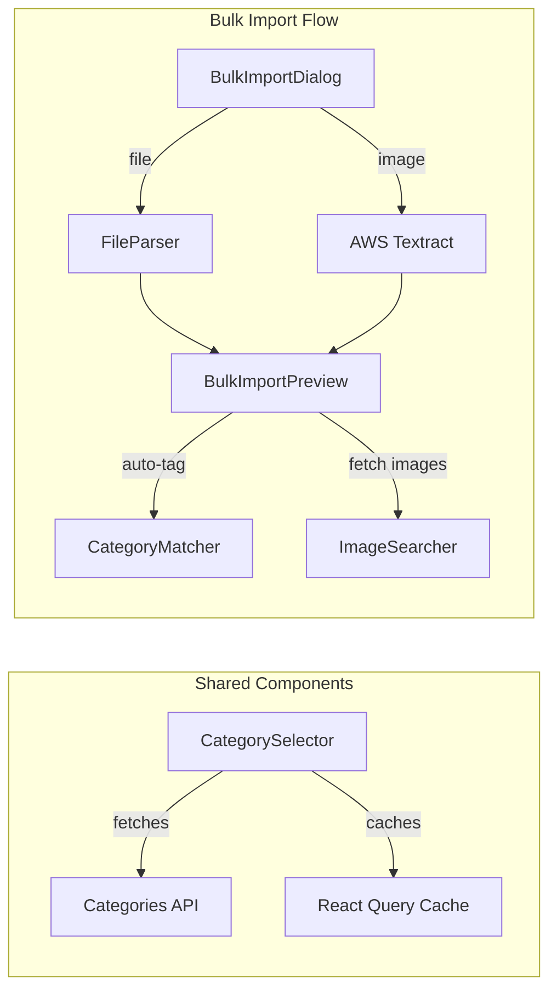

# Design Document

## Overview

This design document outlines the technical implementation for three improvements to the admin console:
1. Database-driven category selection across all product-related screens
2. Performance optimization for the ExtractedProductEditor dialog
3. Bulk import feature for seller inventory with Excel/CSV/image support

## Architecture

### High-Level Architecture

```mermaid
graph TB
    subgraph "Frontend Components"
        A[Products Page] --> D[CategorySelector Component]
        B[Add From Master Page] --> D
        C[ExtractedProductEditor] --> D
        E[Seller Inventory Page] --> F[BulkImportDialog]
        F --> G[BulkImportPreview]
    end
    
    subgraph "API Layer"
        D --> H[/api/admin/categories]
        F --> I[/api/admin/bulk/import]
        G --> J[/api/admin/products]
    end
    
    subgraph "Services"
        I --> K[FileParserService]
        I --> L[AWS Textract OCR]
        G --> M[ImageSearcher]
        G --> N[CategoryMatcher]
    end
    
    subgraph "Database"
        H --> O[(categories)]
        H --> P[(subcategories)]
        J --> Q[(products)]
    end
```

### Component Architecture



## Components and Interfaces

### 1. CategorySelector Component

A reusable component for database-driven category/subcategory selection.

```typescript
interface CategorySelectorProps {
  value: { category: string; subcategory: string };
  onChange: (value: { category: string; subcategory: string }) => void;
  allowNew?: boolean;
  size?: 'small' | 'medium';
  disabled?: boolean;
}

interface Category {
  id: string;
  name: string;
  slug: string;
}

interface Subcategory {
  id: string;
  category_id: string;
  name: string;
  slug: string;
}
```

### 2. Categories API Route

```typescript
// GET /api/admin/categories
interface GetCategoriesResponse {
  categories: Category[];
  subcategories: Subcategory[];
}

// POST /api/admin/categories
interface CreateCategoryRequest {
  name: string;
  type: 'category' | 'subcategory';
  category_id?: string; // Required for subcategory
}

interface CreateCategoryResponse {
  success: boolean;
  data?: Category | Subcategory;
  error?: string;
}
```

### 3. BulkImportDialog Component

```typescript
interface BulkImportDialogProps {
  open: boolean;
  onClose: () => void;
  sellerId: string;
  onImportComplete: (results: ImportResult) => void;
}

interface ParsedProduct {
  name: string;
  price: number;
  min_order_quantity: number;
  description?: string;
  category?: string;
  subcategory?: string;
  imageUrl?: string;
  stock_level: number; // Default 100
}

interface ImportResult {
  successful: number;
  failed: number;
  errors: Array<{ product: string; error: string }>;
}
```

### 4. BulkImportPreview Component

```typescript
interface BulkImportPreviewProps {
  products: ParsedProduct[];
  sellerId: string;
  onConfirm: (products: ParsedProduct[]) => Promise<void>;
  onCancel: () => void;
  categories: Category[];
  subcategories: Subcategory[];
}
```

### 5. File Parser Service

```typescript
interface FileParserService {
  parseExcel(file: File): Promise<ParsedProduct[]>;
  parseCSV(file: File): Promise<ParsedProduct[]>;
  parseImage(file: File): Promise<ParsedProduct[]>;
}
```

### 6. Category Matcher Service

```typescript
interface CategoryMatcherService {
  matchCategory(productName: string, categories: Category[]): Category | null;
  matchSubcategory(
    productName: string, 
    categoryId: string, 
    subcategories: Subcategory[]
  ): Subcategory | null;
}
```

## Data Models

### Database Tables

```sql
-- Existing categories table
CREATE TABLE categories (
  id UUID PRIMARY KEY DEFAULT gen_random_uuid(),
  name VARCHAR(255) NOT NULL,
  slug VARCHAR(255) NOT NULL UNIQUE
);

-- Existing subcategories table
CREATE TABLE subcategories (
  id UUID PRIMARY KEY DEFAULT gen_random_uuid(),
  category_id UUID REFERENCES categories(id) ON DELETE CASCADE,
  name VARCHAR(255) NOT NULL,
  slug VARCHAR(255) NOT NULL,
  UNIQUE(category_id, slug)
);
```

### Expected File Formats

**CSV Format:**
```csv
product_name,price,min_order_quantity
Product A,100.00,5
Product B,250.50,10
```

**Excel Format:**
Same columns as CSV, first row as headers.

**Image Format:**
Handwritten or printed list with product name, price, and quantity in tabular format.

</text>
</invoke>

## C
orrectness Properties

*A property is a characteristic or behavior that should hold true across all valid executions of a system-essentially, a formal statement about what the system should do. Properties serve as the bridge between human-readable specifications and machine-verifiable correctness guarantees.*

### Property 1: Category Filtering Correctness
*For any* input string typed in the category field, the filtered results SHALL only contain categories whose names include the input string as a substring (case-insensitive), and SHALL NOT display incremental typing characters.
**Validates: Requirements 1.3**

### Property 2: Subcategory Filtering by Category
*For any* selected category, the subcategory dropdown SHALL only display subcategories where the `category_id` matches the selected category's `id`.
**Validates: Requirements 1.2**

### Property 3: Slug Generation Consistency
*For any* category or subcategory name, the generated slug SHALL be a lowercase, hyphen-separated version of the name with special characters removed, and SHALL be unique within its table.
**Validates: Requirements 1.5, 1.6**

### Property 4: Debounced State Updates
*For any* sequence of rapid text input events (within 100ms), the component SHALL batch these into a single state update rather than updating on each keystroke.
**Validates: Requirements 2.3**

### Property 5: CSV/Excel Parsing Round-Trip
*For any* valid CSV or Excel file with columns (product_name, price, min_order_quantity), parsing the file SHALL produce an array of ParsedProduct objects where each object's fields match the corresponding row values.
**Validates: Requirements 3.3**

### Property 6: Preview Completeness
*For any* set of extracted products, the preview page SHALL display all products with editable fields for: name, price, min_order_quantity, image, description, category, subcategory, and stock_level (defaulting to 100).
**Validates: Requirements 3.5, 3.6**

### Property 7: Category Auto-Matching
*For any* product name containing keywords that match existing category names, the auto-tag function SHALL assign the matching category and attempt to find a matching subcategory.
**Validates: Requirements 3.7**

### Property 8: Import Result Accuracy
*For any* bulk import operation, the result summary SHALL accurately report the count of successful imports plus failed imports equaling the total products attempted, and SHALL list specific errors for each failed product.
**Validates: Requirements 3.10, 3.11**

### Property 9: Partial Import Resilience
*For any* bulk import where some products fail validation, the system SHALL successfully import all valid products and continue processing after each failure.
**Validates: Requirements 3.9, 3.10**

## Error Handling

### Category API Errors
- **Network Failure**: Display cached categories if available, show error toast, retry with exponential backoff
- **Empty Response**: Fall back to default category list from `categoryUtils.ts`
- **Invalid Data**: Log error, filter out invalid entries, continue with valid data

### File Parsing Errors
- **Invalid File Format**: Display clear error message indicating expected format
- **Missing Required Columns**: Highlight missing columns, allow user to map columns manually
- **Invalid Data Types**: Mark rows with errors, allow user to fix or skip

### OCR Extraction Errors
- **AWS Textract Failure**: Fall back to manual entry mode, display error message
- **Low Confidence Results**: Flag products with confidence < 0.7 for user review
- **No Products Found**: Suggest retaking photo with better lighting/angle

### Import Errors
- **Database Constraint Violation**: Log specific error, continue with next product
- **Duplicate Product**: Offer to update existing or skip
- **Invalid Seller**: Prevent import, require seller selection

## Testing Strategy

### Unit Testing
Unit tests will verify specific examples and edge cases:
- CategorySelector renders with empty categories
- CategorySelector filters categories correctly
- Slug generation handles special characters
- File parser handles empty files
- File parser handles malformed data
- Category matcher handles no matches

### Property-Based Testing
Property-based tests will use **fast-check** library to verify universal properties:

1. **Category Filtering Property Test**
   - Generate random category lists and search strings
   - Verify filtered results always match the search criteria
   - Verify no incremental characters appear

2. **Slug Generation Property Test**
   - Generate random category names
   - Verify slugs are always lowercase, hyphenated, and unique

3. **CSV Parsing Property Test**
   - Generate random valid CSV content
   - Verify parsing produces correct ParsedProduct objects

4. **Import Result Property Test**
   - Generate random product lists with some invalid entries
   - Verify result counts are accurate

### Integration Testing
- End-to-end test of category selection flow
- End-to-end test of bulk import flow
- Performance test of ExtractedProductEditor with 50+ products

### Test Configuration
- Property-based tests: minimum 100 iterations per property
- Each property test tagged with: `**Feature: category-inventory-improvements, Property {number}: {property_text}**`
